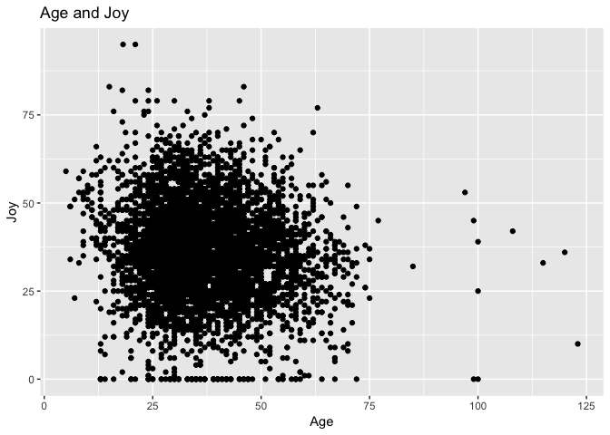
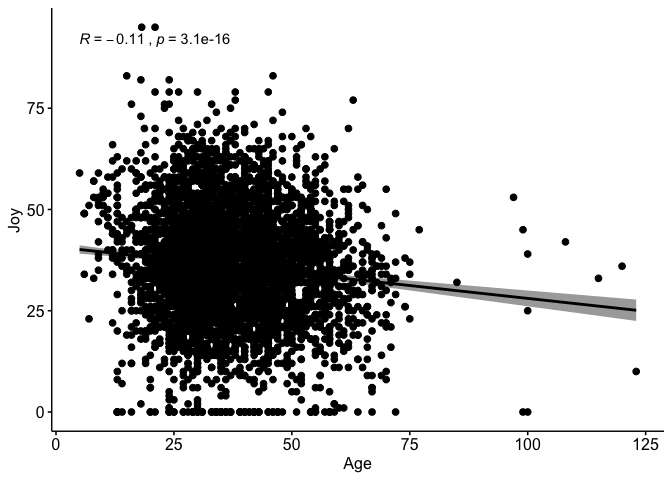

Homework6
================
William Hall
2018-11-01

For the second piece of this homework assignment, I have decided to explore the Candy dataset (since it is Halloween season). I downloaded the Candy dataset from this GitHub account: <https://github.com/jennybc/candy>. I will explore the first option:

1.  Examine how joy/despair scores change with age - I will focus on Joy

This seems like a basic bivariate and regression analysis to me, so I will start with some of these comparisons - then move on to a regression analysis. Let's start with loading in the data.

``` r
library("readr")
library(tidyverse)
```

    ## ── Attaching packages ─────────────────────────────────────────────────────── tidyverse 1.2.1 ──

    ## ✔ ggplot2 3.0.0     ✔ purrr   0.2.5
    ## ✔ tibble  1.4.2     ✔ dplyr   0.7.6
    ## ✔ tidyr   0.8.1     ✔ stringr 1.3.1
    ## ✔ ggplot2 3.0.0     ✔ forcats 0.3.0

    ## ── Conflicts ────────────────────────────────────────────────────────── tidyverse_conflicts() ──
    ## ✖ dplyr::filter() masks stats::filter()
    ## ✖ dplyr::lag()    masks stats::lag()

``` r
library(dplyr)
library("ggpubr")
```

    ## Loading required package: magrittr

    ## 
    ## Attaching package: 'magrittr'

    ## The following object is masked from 'package:purrr':
    ## 
    ##     set_names

    ## The following object is masked from 'package:tidyr':
    ## 
    ##     extract

``` r
CANDY_HIERARCHY_2015_SURVEY_Responses <- read_csv("~/Documents/UBC/Term 7 - Sept. 2018/STAT 545/Homework/Hmk6/Part 2/CANDY-HIERARCHY-2015 SURVEY-Responses.csv")
```

    ## Parsed with column specification:
    ## cols(
    ##   .default = col_character()
    ## )

    ## See spec(...) for full column specifications.

``` r
#View(CANDY_HIERARCHY_2015_SURVEY_Responses)

CandyData <- CANDY_HIERARCHY_2015_SURVEY_Responses
```

1. Clean the data and create new dataset
========================================

The first thing I had to do was select the relevant columns that had data on Joy/Despair and the age column. Because there were so many, rather than using column names I used a more "base R" method that required more lines of code, but that was ultimately easier than writing out all the column names that I wanted.

``` r
CandyData1age <- CandyData[,2]   # select age
CandyData1sea <- CandyData[,114] # select sea candy
CandyData1nec <- CandyData[,115] # select necco waifer candy
CandyData1 <- CandyData[,4:96]   # select the rest of the candy

CandyData1 <- bind_cols(CandyData1,CandyData1age) # combine columns together

CandyData1 <- bind_cols(CandyData1,CandyData1sea) # combine columns together

CandyData1 <- bind_cols(CandyData1,CandyData1nec) # combine columns together
```

Ok. Now we finally have all the data we need. Now what we need to do is count the number of 'Joy's' that each person has responded to for each type of Canday. But first let's reorganize our columns to have the age column first.

``` r
CandyData2 <- CandyData1[,c(94,1:93,95:96)] #this will put the "How old are you column?" first
#names(CandyData2) # test using names()
```

Great now lets create a series of columns that will count each "JOY". So we need to get this to run a function that will count '1' for every JOY for every column -&gt; then create a new column that has the sum of every row. I also created another column that is the percent of Joys that a participant indicated.

``` r
joyCount <- function(x){
  
  length(which(x=="JOY"))
  
}

joyCount(CandyData2[1,])
```

    ## [1] 14

``` r
#this is another way to do this
#buttCount <- str_count(CandyData2$`[Butterfinger]`, "JOY")
#sum(buttCount, na.rm = TRUE)

CandyData3 <- CandyData2 %>% 
                  mutate(Joy = apply(., MARGIN=1, joyCount)) %>% 
                  mutate(JoyPer = Joy/95*100)
```

I also discovered that this age data was pretty poorly constructed. There were a lot of errors that had to be converted into NA's, and unrealistic ages that had to be filtered out. I also changed the name of the age column to age.

``` r
CandyData3$`How old are you?` <- as.numeric(CandyData3$`How old are you?`) #this converts the poorly inputed values into NAs
```

    ## Warning: NAs introduced by coercion

``` r
CandyData4 <- filter(CandyData3, CandyData3$`How old are you?` < 200 & CandyData3$`How old are you?` > 1) #now we only want to choose rows are less than 200 because there might be some bad values in here, and we also limit the min age at 1 to avoid any typos that say that people are 0.

names(CandyData4)[1]<-paste("age") #change name to age
```

2. Bivariate Analysis
=====================

Ok. Now that we have all our variables, let's start with some univariate examination. The mean age of respondents is 36.91, the max age is 123, and the minimum age is 5.

As an absolutely, the mean number of "Joyful" responses was 36.07, the max number of "Joyful" responses was 95, and the minimum number of "Joyful" responses was 0.

As a percentage, the mean percent of "Joyful" responseswas 37.97%, the max number of "Joyful" responses was 100%, and the minimum number of "Joyful" responses was 0%.

Next we can examine the correlation between these two variables.

``` r
#Given the large sample size, we will use parametric correlation - pearson correlation
#For more information visit this site: #http://www.sthda.com/english/wiki/correlation-test-between-two-variables-in-r

cor.test(CandyData4$age, CandyData4$JoyPer, method=c("pearson"))
```

    ## 
    ##  Pearson's product-moment correlation
    ## 
    ## data:  CandyData4$age and CandyData4$JoyPer
    ## t = -8.1957, df = 5358, p-value = 3.089e-16
    ## alternative hypothesis: true correlation is not equal to 0
    ## 95 percent confidence interval:
    ##  -0.13763218 -0.08475031
    ## sample estimates:
    ##      cor 
    ## -0.11127

The correlation analysis suggests that there is a negative correlation between age and Joy. The pvalue is much less than .05 which means we can reject the null hypothesis that the correlation between the two variables is zero.

Let's further examine the relationship via a scatter plot.

``` r
ggplot(CandyData4, aes(x=age, y=Joy)) +
  geom_point() +
  xlab("Age") + 
  ylab("Joy") + 
  ggtitle("Age and Joy")
```



3. Regression Analysis
======================

Let's do a regression analysis.

``` r
linModel <- lm(CandyData4$Joy ~ CandyData4$age, data=CandyData4)
summary(linModel)
```

    ## 
    ## Call:
    ## lm(formula = CandyData4$Joy ~ CandyData4$age, data = CandyData4)
    ## 
    ## Residuals:
    ##     Min      1Q  Median      3Q     Max 
    ## -39.107  -8.293   0.054   8.436  56.910 
    ## 
    ## Coefficients:
    ##                Estimate Std. Error t value Pr(>|t|)    
    ## (Intercept)    40.76015    0.60053  67.874  < 2e-16 ***
    ## CandyData4$age -0.12715    0.01551  -8.196 3.09e-16 ***
    ## ---
    ## Signif. codes:  0 '***' 0.001 '**' 0.01 '*' 0.05 '.' 0.1 ' ' 1
    ## 
    ## Residual standard error: 13.24 on 5358 degrees of freedom
    ## Multiple R-squared:  0.01238,    Adjusted R-squared:  0.0122 
    ## F-statistic: 67.17 on 1 and 5358 DF,  p-value: 3.089e-16

Every 1 year increase in age will result in -0.13 decrease in Joy. Let's plot this.

``` r
ggscatter(CandyData4, x = "age", y = "Joy", 
          add = "reg.line", conf.int = TRUE, 
          cor.coef = TRUE, cor.method = "pearson",
          xlab = "Age", ylab = "Joy")
```



Overall, it seems like there is quite a bit of variation in Joy amongst people of different ages. I probably wouldn't use this linear model to predict someone's level of Joy.
